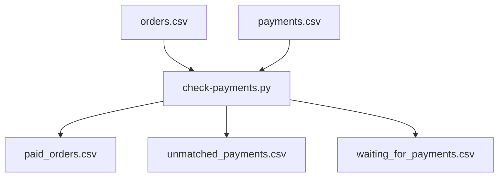

# Алгоритм проверки оплаты заказов: потоки данных

```mermaid
graph TD
    A[orders.csv] --> C[check-payments.py]
    B[payments.csv] --> C[check-payments.py]
    C --> D[paid_orders.csv]
    C --> E[unmatched_payments.csv]
    C --> F[waiting_for_payments.csv]
```